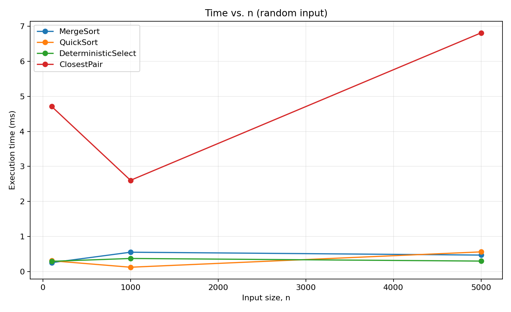
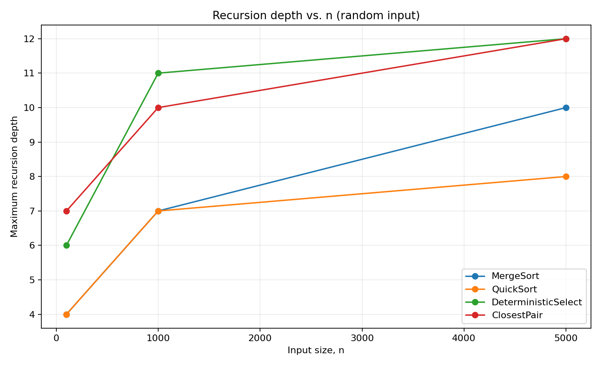
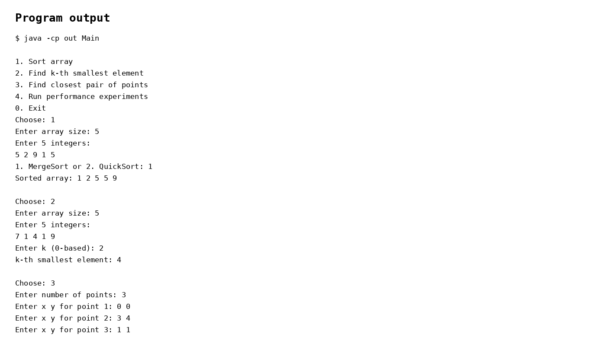
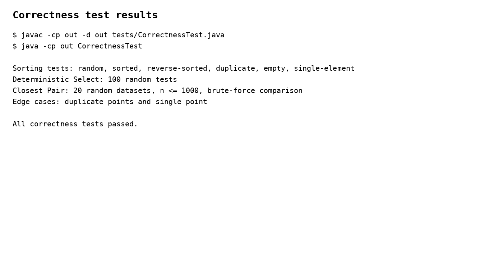

# Assignment 1: Divide-and-Conquer Algorithm Analysis

## A. Project Overview

This project implements four divide-and-conquer algorithms in Java:

- MergeSort
- QuickSort
- Deterministic Select (Median-of-Medians)
- Closest Pair of Points

The project measures execution time, maximum recursion depth, and one additional operation metric. The measured results are saved to `results/results.csv` for comparison with theoretical complexity.

## B. Algorithm Analysis

### MergeSort

MergeSort divides the array into two halves, recursively sorts both halves, and merges them in linear time. A reusable auxiliary buffer is used, and arrays of size 16 or less use Insertion Sort.

Time complexity: Θ(n log n)

Space complexity: O(n)

Recurrence: T(n) = 2T(n/2) + Θ(n)

Master Theorem: a = 2, b = 2, f(n) = Θ(n), so T(n) = Θ(n log n).

### QuickSort

QuickSort chooses a randomized pivot and partitions the array in place. It recursively processes the smaller partition and iterates over the larger partition, which keeps the recursion stack small.

Average/typical time complexity: O(n log n)

Worst-case time complexity: O(n²)

Space complexity: O(log n) for the recursion stack because the smaller side is processed recursively.

Recurrence: T(n) = T(small part) + O(n) while the larger part is handled iteratively. With balanced partitions, this gives O(n log n). A highly unbalanced partition can give O(n²) work.

### Deterministic Select (Median-of-Medians)

The array is divided into groups of five. The median of each group is moved to the front, and the median of these medians is used as the pivot. Only the partition containing the requested k-th element is processed recursively.

Worst-case time complexity: Θ(n)

Space complexity: O(log n) recursion stack in the standard recursive formulation.

Recurrence intuition: T(n) ≤ T(n/5) + T(7n/10) + Θ(n), which is linear by Akra-Bazzi-style reasoning.

### Closest Pair of Points

The points are sorted by x-coordinate. The algorithm recursively solves the left and right halves, builds a strip around the dividing line, and checks points in y-order inside the strip.

Time complexity: Θ(n log n)

Space complexity: O(n)

Recurrence: T(n) = 2T(n/2) + Θ(n), so T(n) = Θ(n log n) by the Master Theorem.

## C. Experimental Results

The program asks for small, medium, and large input sizes through `Scanner`. For every size it tests random, sorted, reverse-sorted, and duplicate-heavy inputs. Results are stored in `results/results.csv`.

The following is the sample experiment run included with the project.

### Execution-time results

#### MergeSort

| Input type | n=100 (ms) | n=1000 (ms) | n=5000 (ms) |
|---|---:|---:|---:|
| random | 0.250 | 0.549 | 0.467 |
| sorted | 0.009 | 0.088 | 0.029 |
| reverse-sorted | 0.064 | 0.347 | 0.272 |
| duplicate-heavy | 0.034 | 0.068 | 0.368 |

#### QuickSort

| Input type | n=100 (ms) | n=1000 (ms) | n=5000 (ms) |
|---|---:|---:|---:|
| random | 0.305 | 0.120 | 0.558 |
| sorted | 0.090 | 0.117 | 0.376 |
| reverse-sorted | 0.055 | 0.072 | 0.457 |
| duplicate-heavy | 0.058 | 0.347 | 0.744 |

#### Deterministic Select

| Input type | n=100 (ms) | n=1000 (ms) | n=5000 (ms) |
|---|---:|---:|---:|
| random | 0.289 | 0.370 | 0.295 |
| sorted | 0.081 | 0.112 | 0.222 |
| reverse-sorted | 0.053 | 0.151 | 0.236 |
| duplicate-heavy | 0.056 | 0.047 | 0.115 |

#### Closest Pair

| Input type | n=100 (ms) | n=1000 (ms) | n=5000 (ms) |
|---|---:|---:|---:|
| random | 4.712 | 2.602 | 6.813 |
| sorted | 0.315 | 1.638 | 4.589 |
| reverse-sorted | 0.252 | 1.232 | 2.622 |
| duplicate-heavy | 0.367 | 2.155 | 4.519 |

### Recursion-depth results

| Algorithm | n=100 | n=1000 | n=5000 |
|---|---:|---:|---:|
| MergeSort | 4 | 7 | 10 |
| QuickSort | 4 | 7 | 8 |
| DeterministicSelect | 6 | 11 | 12 |
| ClosestPair | 7 | 10 | 12 |

The CSV file contains all four input types for all three sizes.

### Time vs. n



### Recursion Depth vs. n



## D. Discussion

The included tables are one sample run from the project environment. The same experiment can be rerun from `Main` with `Scanner` input before submission to record results from the target machine.

The measured results should generally follow the theoretical trends, but exact timings are affected by the JVM, JIT compilation, CPU cache, garbage collection, memory allocation, and system load.

Input structure affects partitioning and therefore QuickSort performance. Randomized pivots reduce dependence on the original ordering, while reverse-sorted or duplicate-heavy inputs can change the number of comparisons and swaps.

Smaller-first recursion in QuickSort keeps the recursive side bounded by the smaller partition. The larger partition is processed by iteration, so the recursion stack remains O(log n).

Median-of-Medians guarantees a pivot that removes a constant fraction of the elements, so the recursive work stays linear in the worst case.

The divide-and-conquer Closest Pair algorithm avoids checking every pair. Its strip step checks only a constant number of following points for each point, giving Θ(n log n) time rather than O(n²) for large inputs.

## E. Reflection

This assignment showed how a divide-and-conquer algorithm can have a strong theoretical advantage, but also how implementation details affect practical performance. The main implementation challenges were keeping recursion depth under control, handling duplicate values and edge cases, and collecting measurements without changing the algorithmic structure.

The experiments also made the difference between theoretical complexity and real execution time clearer. JVM warm-up, cache behavior, garbage collection, and input structure can change measured times even when the asymptotic complexity stays the same.

## F. Screenshots

### Program output



### Test results



### Plots

The plots are stored in `docs/plots/` and are included above.

## Repository Structure

```text
assignment1-divide-and-conquer/
├── src/
│   └── main/
│       └── java/
│           ├── MergeSorter.java
│           ├── QuickSorter.java
│           ├── DeterministicSelector.java
│           ├── ClosestPairSolver.java
│           ├── Experiment.java
│           ├── Point.java
│           └── Main.java
├── tests/
│   └── CorrectnessTest.java
├── docs/
│   ├── screenshots/
│   └── plots/
├── results/
│   └── results.csv
├── README.md
├── pom.xml
└── .gitignore
```

## Run

Compile the main classes:

```bash
javac -d out src/main/java/*.java
```

Run the program:

```bash
java -cp out Main
```

Run correctness tests:

```bash
javac -cp out -d out tests/CorrectnessTest.java
java -cp out CorrectnessTest
```
